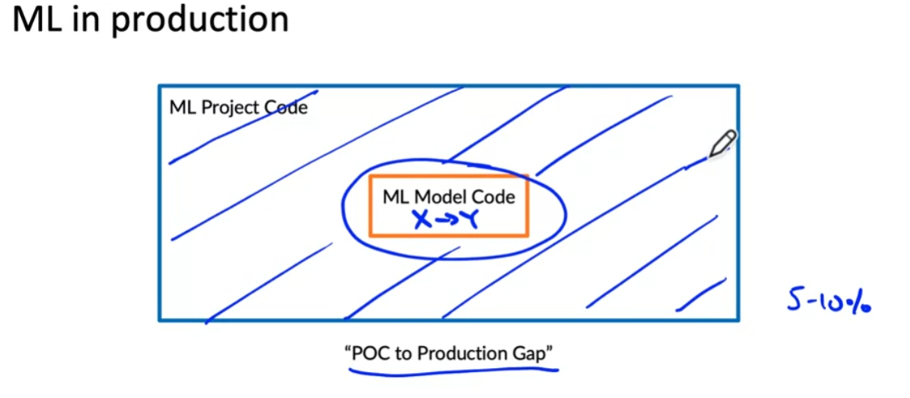
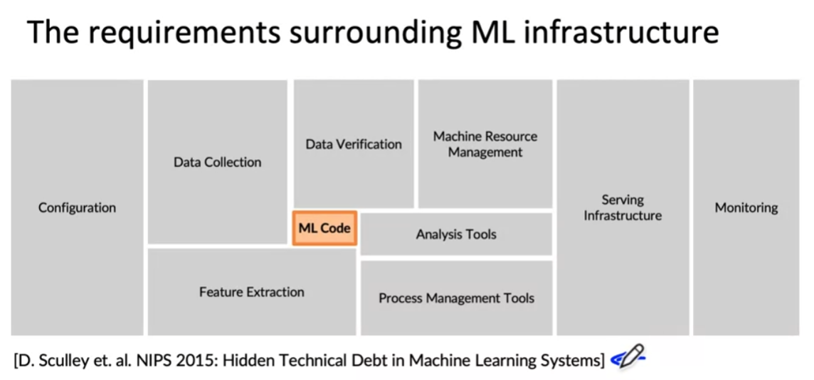
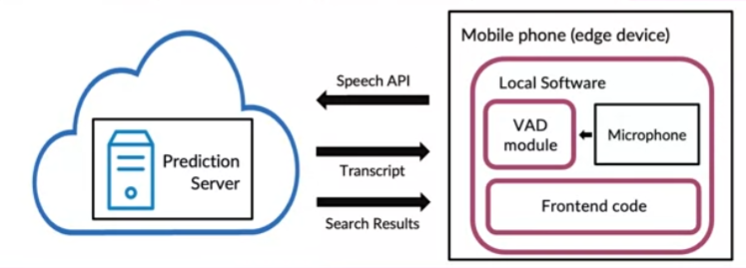

Usually after training a learning algorithm that does well on the test set, there will still be many things to do to make the algorithm be applied in production, due to the **concept drift or data drift**. It is important to make sure that our machine-learning model don't just do well on the hold-out test set, but actually create value in a practical production deployment environment. **It is all about "practice".** 

What is all the other stuff besides the ML codes?

There many components beyond the ML codes, especially components for managing the data, such as data collection, data verification, feature extraction
## Steps of an ML Project
1. Scoping. Define project or decide what to work on. What exactly do you want to apply machine learning to, and what is `X` and what is `Y`
2. Data.
   1. Define data and establish baseline;
   2. Label and organize the data.
3. Modeling.
   1. Select and train the model ;
   2. Perform error analysis.
4. Deployment.
   1. Deploy in production;
   2. Monitor and maintain system.
You may find that machine learning is often a highly iterative task when you perform the error analysis or monitor and maintain system.

## Case study:speech recognition
1. Scoping.
   1. Decide to work on speech recognition for voice search.
   2. Decide on key metrics:
      -   accuracy, latency, throughput
   3. Estimate resources and timeline.
2. Data.
   1. Is the data labeled consistently? With noise around the world. So spotting inconsistencies and addressing them is important.
   2. How much silence before/after each clip of the speech?
   3. How to perform volume normalization?
**We need a systematic framework for making sure we have high quality data.**
3. Modeling.
   1. Code(the algorithm or the neural network model architecture that you might choose)
   2. Hyper-parameters
   3. Data
   4. Error analysis
4. Deployment.
   

One of the key challenges: concept drift or data drift