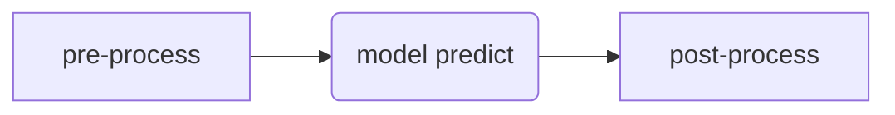

My incoming task is about pre/post process of data. Reference: [Seldon](https://docs.seldon.io/projects/seldon-core/en/latest/examples/transformers-v2-protocol.html), [KServe](https://kserve.github.io/website/0.9/modelserving/v1beta1/transformer/feast/). The key issue is how to make it decoupling from other component and easy to use. In general, pre-process provides an interface which can transform data into standard form from any other non-standard data.

## Pre-Process
Reference: [Transformers](https://huggingface.co/docs/transformers/preprocessing#preprocess)
### Textual
**Tokenize**. A tokenizer starts by splitting text into tokens according to a set of rules. The tokens are converted into numbers, which are used to build tensors as input to a model. Any additional inputs required by a model are also added by the tokenizer.
**Padding**. Padding is a strategy for ensuring tensors are rectangular by adding a special padding token to sentences with fewer tokens.
**Truncation**. Sometimes a sequence may be too long for a model to handle. In this case, you will need to truncate the sequence to a shorter length.

### Audio
**Resample**
**Feature extract**
**Padding and truncate**
### Vision
**Feature extract**
**Data augmentation**
### Multimodal