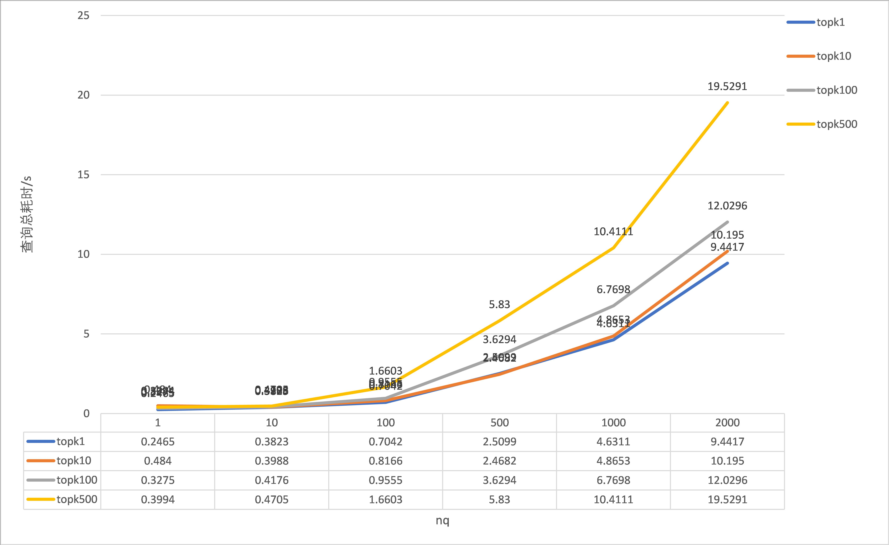

## milvus性能测试记录
数据采用的官方benchmark中使用的数据，[ANN_SIFT1M](http://corpus-texmex.irisa.fr/)，一百万条128维的特征数据。
测试代码已经上传至[github]()  
部分测试结果如下：

和官方的benchmark差距很大，代码中配置的查询参数、索引参数均与官方一致。测试的代码参考了官方的[BootCamp](https://github.com/milvus-io/bootcamp/tree/master/benchmark_test)项目, 但是官方文档里的数据来自于另外一套更复杂的[benchmark](https://github.com/milvus-io/milvus/tree/master/tests/benchmark)代码